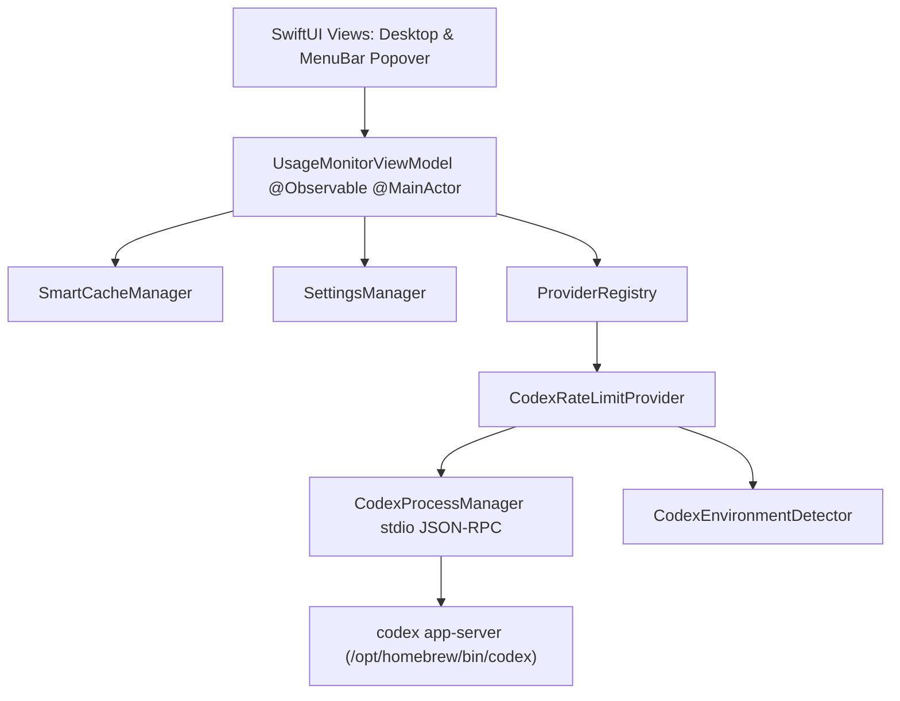

# 🚀 AgentMeter 專案交接文件 (handoff.md)

本文件整理了 **AgentMeter** 專案的架構、目前 MVP 實作成效、技術細節、規範以及開啟新對話時供下一位 AI Agent / 開發者快速銜接的交接 Prompt。

---

## 📌 1. 專案概況 (Project Overview)

- **專案名稱**：AgentMeter
- **定位**：macOS 原生（macOS 15+ / 26+）AI Agent 額度與用量即時監控工具（MenuBar 常駐 + Desktop 獨立視窗）。
- **遠端倉庫**：`https://github.com/yuhaw0715/AgentMeter.git`（主要分支：`main`）
- **目前進度**：`agentmeter-mvp` 階段已 100% 實作完成，代碼全數通過測試並已推送到遠端倉庫。

---

## 🏛️ 2. 系統架構與核心模組 (System Architecture)

採用 **Swift 6 + SwiftUI + Clean Architecture + MVVM** 架構：



### 核心模組分層：
1. **Domain Layer (`Sources/AgentMeterCore/Domain/`)**：
   - `RateLimitItem`：通用的額度項目模型（名稱、使用率、重置時間、已用/剩餘量等）。
   - `RateLimitSnapshot`：一次完整的額度快照。
   - `ProviderType`：支援的供應商枚舉（`.codex`、預留 `.gemini`、`.antigravity` 等）。
   - `EnvironmentStatus`：環境健康度（`.healthy`、`.cliMissing`、`.notAuthenticated` 等）。
   - `AgentProvider`：Provider 抽象通訊協定，具備解耦與多 Provider 擴充性。

2. **Provider Layer (`Sources/AgentMeterCore/Providers/Codex/`)**：
   - `CodexProcessManager`：底層 JSON-RPC 2.0 stdio 串流處理器。發送請求前自動執行 `initialize` 握手協議，確保與官方 `codex app-server` 連線順暢。
   - `CodexRateLimitProvider`：精確解析官方 `rateLimits` 物件（`primary` 5 小時工作階段額度、`secondary` 每週額度、`planType` 方案等級），並支援動態未知額度的向下相容解析。
   - `CodexEnvironmentDetector`：自動掃描 `/opt/homebrew/bin/codex`、`/usr/local/bin`、`PATH` 或使用者自訂路徑。

3. **Services & ViewModel Layer (`Sources/AgentMeterCore/Services/ & ViewModels/`)**：
   - `SmartCacheManager`：記憶體快取與可自訂 TTL（預設 5 分鐘），避免對本機 CLI 造成過度頻繁負載。
   - `SettingsManager`：本機 `UserDefaults` 設定管理（開機啟動 `SMAppService`、語系、快取時間、Menu Bar 顯示額度項目）。
   - `UsageMonitorViewModel`：Swift 6 `@Observable` 響應式狀態中心，支援 Desktop 勾選核取方塊即時聯動 Menu Bar 顯示項目。
   - `ReportSanitizer`：自動遮蔽 Email、API Token、金鑰等隱私敏感資訊，生成診斷報告。

4. **UI Presentation Layer (`Sources/AgentMeter/`)**：
   - `AgentMeterApp`：整合 `Window`（單例主視窗）與 `MenuBarExtra`（常駐 Popover）。透過 `AppDelegate` 管理視窗焦點喚醒與 Dock 重開事件。
   - `MainDesktopContainerView`：側邊欄導航（ChatGPT Codex、偏好設定、環境診斷）。
   - `UsageDashboardView`：即時額度卡片、雙列資訊標頭（標題/重新整理、Email/`yyyy-MM-dd HH:mm:ss` 時間）、左側即時 Menu Bar 釘選 Checkbox。
   - `MenuBarPopoverView`：自適應高度 Menu Bar 彈出卡片清單、快捷開啟主視窗與離開按鈕。
   - `SettingsView`：開機啟動、快取 TTL、介面語言（右對齊）與 CLI 路徑設定。
   - `DiagnosticsView`：系統狀態表格與一鍵複製去敏診斷報告。

5. **視覺資產 (`Resources/` & `Sources/AgentMeter/Resources/`)**：
   - **Menu Bar 圖示**：Concept 2（純粹極簡粗體 `AM` Monogram）。
   - **App 圖示**：Option B4（深炭灰霧面去背 Squircle + 純白粗體 `AM`，包含全套 `AppIcon.icns` 與 `AppIcon.png`）。

6. **在地化 (`Sources/AgentMeterCore/Localization/`)**：
   - `L10n`：動態切換繁體中文、英文與系統預設語系。
   - `DateFormatterHelper`：標準 `yyyy-MM-dd HH:mm:ss` 時間格式與語系時區格式化。

---

## 🧪 3. 測試與驗證現況 (Verification & Test Status)

- **單元與整合測試 (`swift test`)**：**7 大測試套件共 19 項測試 100% 通過**（包含與本機真實 `/opt/homebrew/bin/codex app-server` 的實測抓取連線）。
- **正式發布編譯 (`swift build -c release`)**：0 警告、0 錯誤。
- **Homebrew Cask**：已備妥 `Casks/agentmeter.rb` 支援 `--zap` 清理路徑。

---

## 📜 4. 協作規範與規則 (Collaboration Guidelines)

新對話中的 Agent **必須嚴格遵守以下規範**：
1. **Git 規範**：
   - ⚠️ **未經使用者明確指示，嚴禁自動執行 `git commit` 或 `git push`**。
   - 所有 Git Commit 訊息必須使用**繁體中文**撰寫（遵循語意化格式如 `feat:`、`fix:` 等）。
2. **語言規範**：
   - 所有的規劃文件（Implementation Plan、OpenSpec 規格、Design、Tasks、Handoff、Walkthrough）一律使用**繁體中文**撰寫。
3. **AGENTS.md 規範**：
   - 若需修改 `AGENTS.md`，必須先將變更差異（Diff）呈現給使用者審閱並獲得同意後方可寫入。
4. **規範驅動開發 (Spec-Driven)**：
   - 遵循 `openspec/` 流程管理需求變更。

---

## 🧭 5. 專案目錄結構 (Project Structure)

```text
AgentMeter/
├── AGENTS.md                  # Agent 協作規範與目前專案進度
├── handoff.md                 # 本交接文件
├── Package.swift              # Swift 6 SPM 配置（AgentMeterCore, AgentMeter, AgentMeterTests）
├── Casks/
│   └── agentmeter.rb          # Homebrew Cask 發布配方
├── Resources/                 # 應用程式圖示 (AppIcon.icns, AppIcon.png) 與 Entitlements
├── Sources/
│   ├── AgentMeterCore/        # 核心商業邏輯（Domain, Providers, Services, ViewModels, Localization）
│   └── AgentMeter/            # SwiftUI 介面與 App 進入點（Desktop Views, MenuBar Views, Components）
├── Tests/
│   └── AgentMeterTests/       # 19 項單元與整合測試套件
└── openspec/                  # OpenSpec 規格資料夾
    └── changes/
        └── agentmeter-mvp/    # MVP 變更規格（proposal, specs, design, tasks）
```

---

## 💬 6. 新對話交接 Prompt (New Session Prompt)

當開啟新的對話時，請**直接複製以下內容**貼給新的 AI 對話窗口，即可無縫開啟新需求討論：

```markdown
你好！我是 AgentMeter 專案的開發者。

【專案背景】
AgentMeter 是一套專為 macOS（SwiftUI + Swift 6）打造的原生 AI Agent 額度與用量即時監控工具（支援 Menu Bar 常駐 Popover 與獨立 Desktop 視窗）。
目前專案的 MVP 階段（包含 ChatGPT Codex app-server 即時連線、多國語言切換、即時 Menu Bar 釘選勾選、AM 品牌圖示等）已 100% 實作完成並通過全部 19 項自動化測試，已推送到 GitHub main 分支。

【專案詳細資訊與架構】
請先仔細閱讀專案中的以下重要文件：
1. `AGENTS.md`：專案規範、Git 限制（未指示不可自動 commit/push、所有 commit 與企劃文件一律繁體中文、更新 AGENTS.md 需先出 diff）。
2. `handoff.md`：完整架構交接與模組分工。
3. `openspec/specs/` 與 `openspec/changes/archive/2026-08-29-agentmeter-mvp/`：已歸檔的 MVP 主規格與架構設計。

我現在準備要與你討論「下一階段的新需求」，請確認你已掌握專案現況與規範，並告知我隨時可以開始討論新需求！
```
