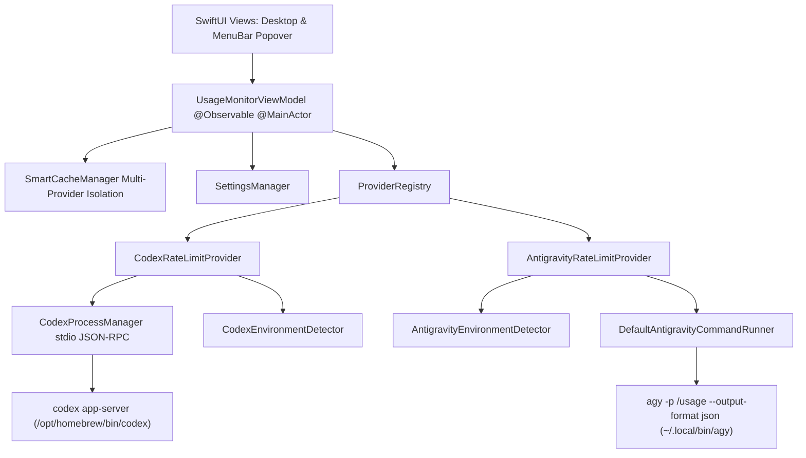

# 🚀 AgentMeter 專案交接文件 (handoff.md)

本文件整理了 **AgentMeter** 專案的架構、目前最新實作成效、技術細節、規範以及開啟新對話時供下一位 AI Agent / 開發者快速銜接的交接 Prompt。

---

## 📌 1. 專案概況 (Project Overview)

- **專案名稱**：AgentMeter
- **定位**：macOS 原生（macOS 15+ / 26+）AI Agent 額度與用量即時監控工具（MenuBar 常駐 + Desktop 獨立視窗）。
- **遠端倉庫**：`https://github.com/yuhaw0715/AgentMeter.git`（主要分支：`main`）
- **目前進度**：
  - `agentmeter-mvp`（ChatGPT Codex 支援）已 100% 實作完成並歸檔。
  - `add-antigravity-usage`（Google Antigravity Gemini 支援）已 100% 實作完成並歸檔，12 大測試套件共 31 項測試全數通過。
  - `add-release-build-script`（macOS App Bundle、GitHub Release ZIP 與 Homebrew 發布流程）已 100% 實作、完成實機安裝驗證並歸檔。
  - GitHub Release `v0.1.0` 的 `AgentMeter-v0.1.0.zip` 已可由 `yuhaw0715/tap/agentmeter` 正確下載、通過 checksum 並安裝。

---

## 🏛️ 2. 系統架構與核心模組 (System Architecture)

採用 **Swift 6 + SwiftUI + Clean Architecture + MVVM** 架構：



### 核心模組分層：
1. **Domain Layer (`Sources/AgentMeterCore/Domain/`)**：
   - `RateLimitItem`：通用的額度項目模型（名稱、使用率、重置時間、已用/剩餘量等）。
   - `RateLimitSnapshot`：一次完整的額度快照。
   - `ProviderType`：支援的供應商枚舉（`.codex`、`.antigravity`、預留 `.gemini`）。
   - `EnvironmentStatus`：環境健康度（`.healthy`、`.cliMissing`、`.unsupportedVersion`、`.notAuthenticated` 等）。
   - `AgentProvider`：Provider 抽象通訊協定，具備解耦與多 Provider 擴充性。

2. **Provider Layer (`Sources/AgentMeterCore/Providers/`)**：
   - **Codex (`Codex/`)**：
     - `CodexProcessManager`：底層 JSON-RPC 2.0 stdio 串流處理器與握手協議。
     - `CodexRateLimitProvider`：精確解析 5h / Weekly 動態額度。
     - `CodexEnvironmentDetector`：自動掃描 `/opt/homebrew/bin/codex`、`PATH` 或使用者自訂路徑。
   - **Antigravity (`Antigravity/`)**：
     - `AntigravityRateLimitProvider`：一次性子行程與 10 秒硬性逾時，以 `agy -p "/usage" --output-format json` 唯讀查詢，精確過濾提取有效 Gemini Models bucket。
     - `AntigravityEnvironmentDetector`：自動掃描 `~/.local/bin/agy`、`PATH` 或自訂路徑，並進行 SemVer $\ge 1.1.11$ 判定。
     - `AntigravityError`：專屬錯誤分類與 Localized 錯誤訊息。

3. **Services & ViewModel Layer (`Sources/AgentMeterCore/Services/ & ViewModels/`)**：
   - `SmartCacheManager`：支援多 Provider 快取隔離與可自訂 TTL（預設 5 分鐘）。
   - `SettingsManager`：本機 `UserDefaults` 設定管理（雙 Provider 自訂路徑、開機啟動、語系、快取時間、每 Provider Menu Bar 顯示額度項目）。
   - `UsageMonitorViewModel`：Swift 6 `@Observable` 響應式狀態中心，多 Provider 狀態隔離、Desktop 前景切換強制更新與 Menu Bar 自適應同步。
   - `ReportSanitizer`：自動遮蔽 Email、API Token、Google Key、主目錄等隱私敏感資訊，生成診斷報告。

4. **UI Presentation Layer (`Sources/AgentMeter/`)**：
   - `AgentMeterApp`：整合 `Window`（單例主視窗）與 `MenuBarExtra`（常駐 Popover）。
   - `MainDesktopContainerView`：側邊欄導航（ChatGPT Codex、Google Antigravity、偏好設定、環境診斷）。
   - `UsageDashboardView`：即時額度卡片、雙列資訊標頭、左側即時 Menu Bar 釘選 Checkbox。
   - `MenuBarPopoverView`：自適應高度 Menu Bar 彈出卡片清單（依 Provider 分組）、快捷開啟主視窗與離開按鈕。
   - `EnvironmentSetupView`：環境未就緒指引、版本不相容升級指引與 Terminal 登入引導。
   - `SettingsView`：開機啟動、快取 TTL、介面語言與雙 Provider CLI 路徑設定。
   - `DiagnosticsView`：雙 Provider 系統狀態表格與一鍵複製去敏診斷報告。

5. **視覺資產 (`Resources/` & `Sources/AgentMeter/Resources/`)**：
   - **Menu Bar 圖示**：Concept 2（純粹極簡粗體 `AM` Monogram）。
   - **App 圖示**：Option B4（深炭灰霧面去背 Squircle + 純白粗體 `AM`）。

6. **在地化 (`Sources/AgentMeterCore/Localization/`)**：
   - `L10n`：動態切換繁體中文、英文與系統預設語系。
   - `DateFormatterHelper`：標準 `yyyy-MM-dd HH:mm:ss` 時間格式與語系時區格式化。

---

## 🧪 3. 測試與驗證現況 (Verification & Test Status)

- **單元與整合測試 (`swift test`)**：**12 大測試套件共 31 項測試 100% 通過**（包含與本機真實 `codex app-server` 及 `agy /usage` 的實測抓取連線）。
- **正式發布編譯 (`swift build -c release`)**：0 警告、0 錯誤。
- **發布腳本 (`scripts/build-release.sh`)**：已通過 Shell 語法、App Bundle 結構、`plutil`、`codesign --verify --deep --strict`、ZIP 頂層結構與 SHA-256 驗證。
- **發布產物**：`releases/AgentMeter-v0.1.0.zip`（Apple Silicon `arm64`，約 3.8 MB），SHA-256 為 `3e6d91bde7f4167ca5571e39efa462dbd6d2a1c65cd50e1c02eb63b0a5eadbe2`。
- **Homebrew Cask**：已由 `brew install --cask yuhaw0715/tap/agentmeter` 完成實機安裝；支援範圍受限 quarantine 清理與 `--zap`。
- **OpenSpec**：`add-release-build-script` 已同步至主規格並歸檔為 `openspec/changes/archive/2026-08-30-add-release-build-script/`；歸檔後 strict validation 通過。

---

## 📦 4. 發布流程與儲存庫狀態 (Release Workflow & Repository Status)

### AgentMeter 發布產物

執行：

```bash
./scripts/build-release.sh
```

腳本會：

1. 以 SwiftPM Release 組態建置 AgentMeter。
2. 建立完整 `AgentMeter.app`，複製 Info.plist、AppIcon 與 SwiftPM resource bundle。
3. 預設以 ad-hoc identity 簽署；亦可透過 `CODESIGN_IDENTITY` 指定 Developer ID。
4. 驗證 App Bundle 與簽署後，產生 `releases/AgentMeter-v<版本>.zip`。
5. 驗證 ZIP 結構並輸出 SHA-256。
6. 全部成功後自動移除中間 `releases/AgentMeter.app`；失敗時保留供除錯。

`releases/` 已由 `.gitignore` 排除，發布二進位不納入 Git。

### GitHub Release 與 Homebrew Tap

- AgentMeter repository：`https://github.com/yuhaw0715/AgentMeter.git`
- Homebrew tap repository：`https://github.com/yuhaw0715/homebrew-tap.git`
- Release asset 命名：`AgentMeter-v#{version}.zip`
- Cask token／檔名：`agentmeter`／`Casks/agentmeter.rb`
- 安裝指令：`brew install --cask yuhaw0715/tap/agentmeter`
- Cask macOS 相依語法：`depends_on macos: :sequoia`

重要 commits：

- AgentMeter `3d9bff4`：新增 Homebrew 發布產物建置流程。
- AgentMeter `ab5c4f7`：完善發布產物清理、驗證、OpenSpec 與 AGENTS 狀態。
- homebrew-tap `69a2258`：新增 AgentMeter Homebrew Cask。
- homebrew-tap `8bbebcd`：更新 AgentMeter 發布套件 checksum。
- homebrew-tap `e50ec0f`：更新 macOS 相依語法。

### 下一步

1. 依使用者審閱結果提交本次 OpenSpec 歸檔與文件狀態更新；未經明確指示不得 commit／push。
2. 未來每次發布前更新 `Resources/Info.plist` 版本、重跑發布腳本、上傳確切 ZIP，並以該 ZIP 的 SHA-256 更新 tap。

---

## 📜 5. 協作規範與規則 (Collaboration Guidelines)

新對話中的 Agent **必須嚴格遵守以下規範**：
1. **Git 規範**：
   - ⚠️ **未經使用者明確指示，嚴禁自動執行 `git commit` 或 `git push`**。
   - 所有 Git Commit 訊息必須使用**繁體中文**撰寫（遵循語意化格式如 `feat:`、`fix:` 等）。
2. **語言規範**：
   - 所有的規劃文件（Implementation Plan、OpenSpec 規格、Design、Tasks、Handoff、Walkthrough）一律使用**繁體中文**撰寫。
3. **AGENTS.md 規範**：
   - 若需修改 `AGENTS.md`，必須先將變更差異（Diff）呈現給使用者審閱並獲得同意後方可寫入。
4. **規範驅動開發 (Spec-Driven)**：
   - 遵循 `openspec/` 流程管理需求變更。

---

## 🧭 6. 專案目錄結構 (Project Structure)

```text
AgentMeter/
├── AGENTS.md                  # Agent 協作規範與目前專案進度
├── handoff.md                 # 本交接文件
├── Package.swift              # Swift 6 SPM 配置（AgentMeterCore, AgentMeter, AgentMeterTests）
├── scripts/
│   └── build-release.sh       # App Bundle、簽署、ZIP、checksum 與中間產物清理
├── Casks/
│   └── agentmeter.rb          # Homebrew Cask 發布配方
├── releases/                  # 本機發布產物（由 .gitignore 排除）
├── Resources/                 # 應用程式圖示 (AppIcon.icns, AppIcon.png) 與 Entitlements
├── Sources/
│   ├── AgentMeterCore/        # 核心商業邏輯（Domain, Providers, Services, ViewModels, Localization）
│   └── AgentMeter/            # SwiftUI 介面與 App 進入點（Desktop Views, MenuBar Views, Components）
├── Tests/
│   └── AgentMeterTests/       # 31 項單元與整合測試套件
└── openspec/                  # OpenSpec 規格資料夾
    ├── specs/                 # 已生效的主規格
    └── changes/
        └── archive/           # 已歸檔歷史變更（含 add-release-build-script）
```

---

## 🤝 7. 新對話交接 Prompt

```text
請接手 /Users/yuhao/Projects/AgentMeter 專案，先完整閱讀 AGENTS.md 與 handoff.md，並嚴格遵守其中規範。

目前 ChatGPT Codex 與 Google Antigravity 雙 Provider 額度監控均已完成，12 套測試共 31 項測試全數通過。macOS 發布流程 `add-release-build-script` 亦已完成：`scripts/build-release.sh` 會建立、簽署及驗證 App Bundle，輸出版本化的 `releases/AgentMeter-v<版本>.zip`，計算 SHA-256，並在成功後移除中間 AgentMeter.app。GitHub Release v0.1.0 與 Homebrew Cask `yuhaw0715/tap/agentmeter` 已完成實機安裝驗證。

請先檢查兩個 repository 的 git status 與最近 commits，不要修改或覆蓋任何使用者既有變更。`add-release-build-script` 已同步至主規格並歸檔於 `openspec/changes/archive/2026-08-30-add-release-build-script/`。若需要進行其他複雜變更，先依 OpenSpec 流程提出繁體中文 Proposal／Design／Tasks 並等待核准。

未經我明確指示，不得執行 git commit 或 git push；所有 commit 訊息、OpenSpec 文件、實作計畫與結案文件均使用繁體中文。
```
